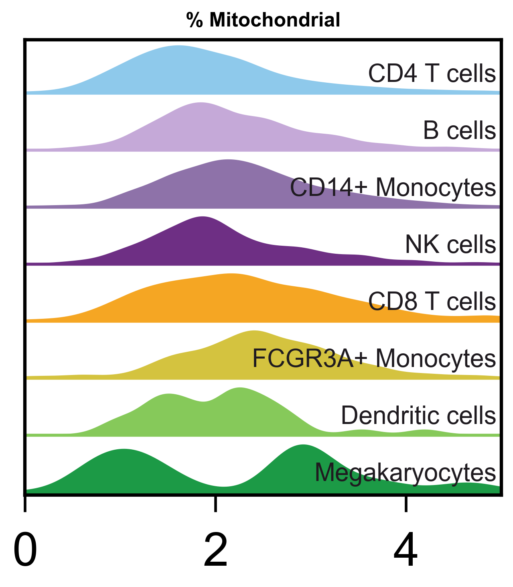
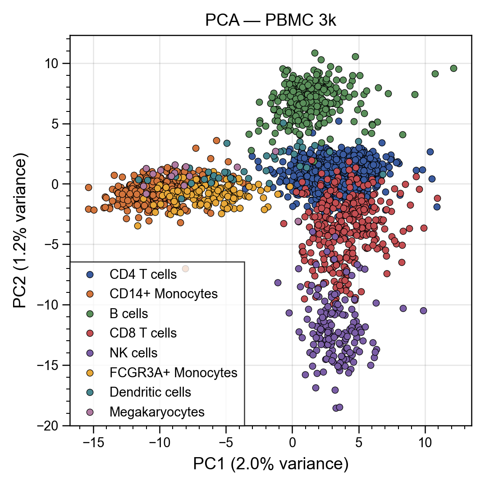
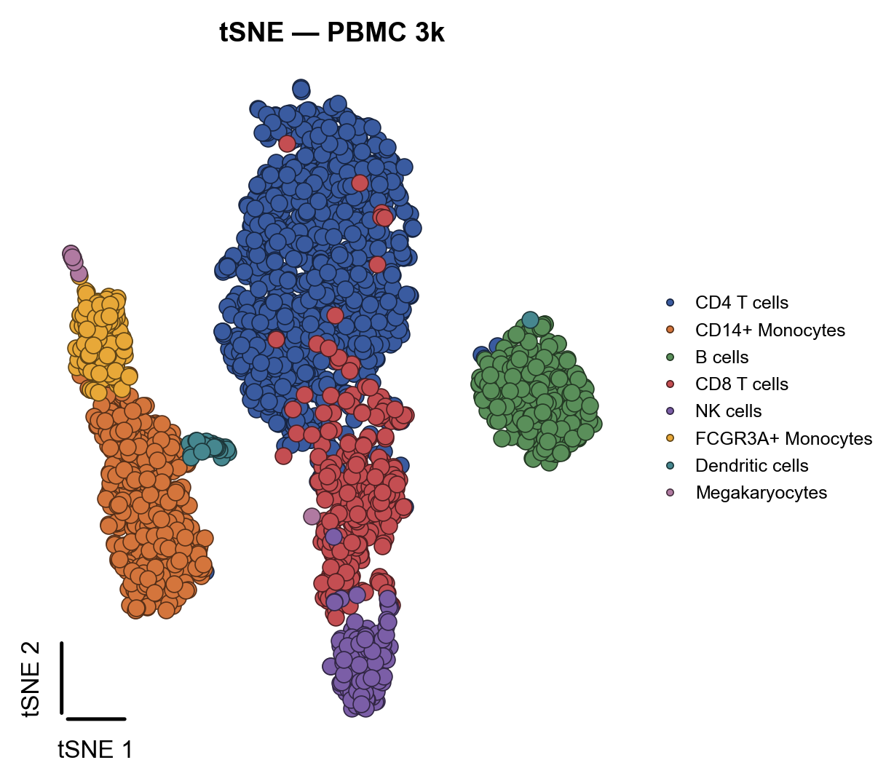
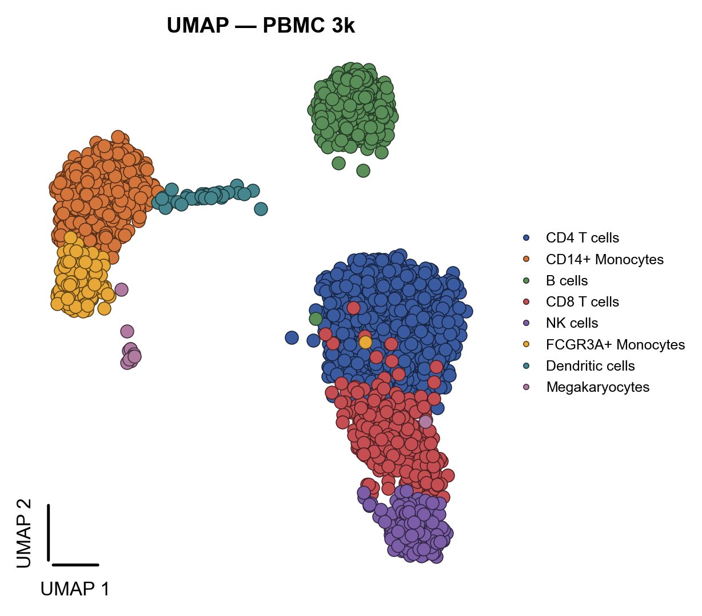
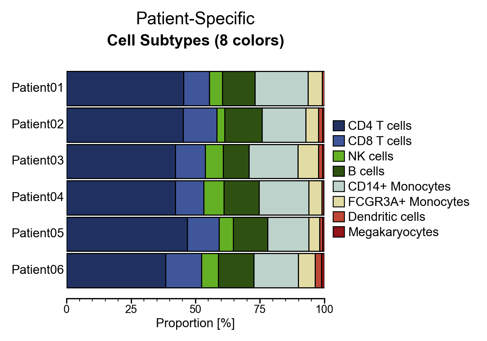
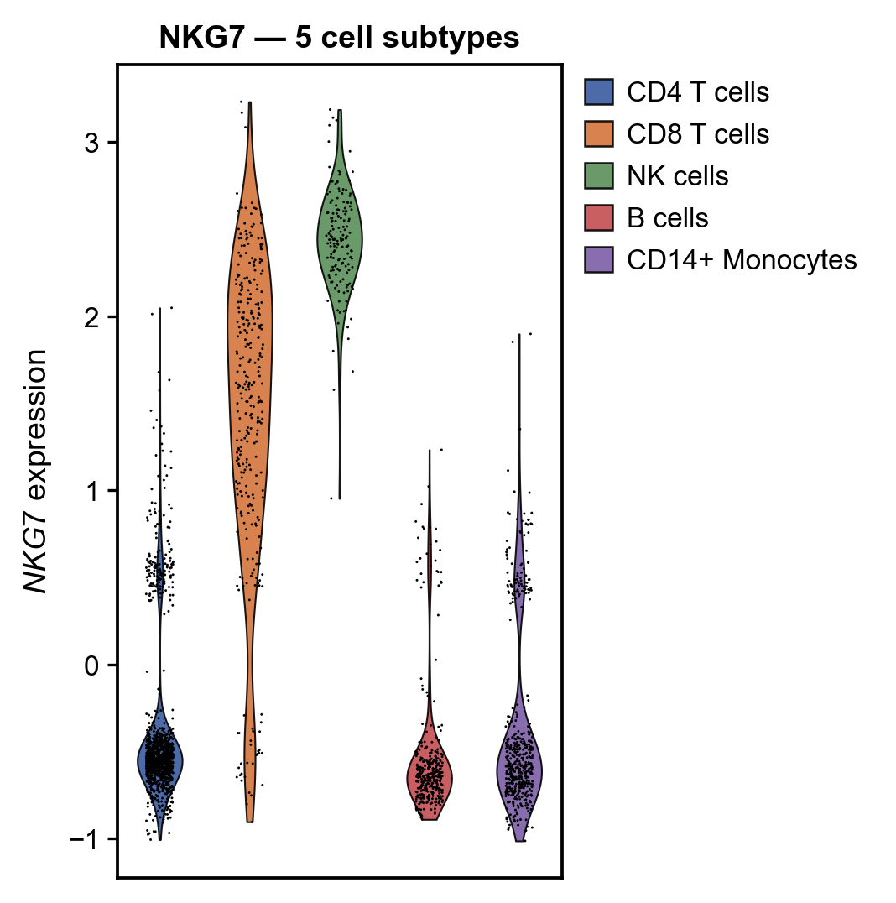

# pypubplot

**pypubplot** is an opinionated plotting library for single-cell analysis and academic publication. Built on top of [ultraplot](https://ultraplot.readthedocs.io/) (a matplotlib wrapper), it provides publication-ready defaults: colorblind-friendly palettes, clean axis styling, and one-call export to PNG or SVG at ≥300 DPI.

## Functionality

- **Ridge plots** — QC metric distributions grouped by cell type or sample.
- **PCA scatter** — Principal components with confidence ellipses and auto-labeled clusters.
- **Embeddings (UMAP / t-SNE)** — Categorical or continuous overlays with L-shaped axis stubs.
- **Cell composition** — Horizontal stacked-bar charts for subtype proportions.
- **Violin plots** — Grouped distributions with jitter dots and automatic legend handling.

All functions return `(fig, ax)` so you can fine-tune before saving.

## Setup

Install from PyPI (once published) or directly from GitHub:

```bash
pip install pypubplot
```

Or with `uv`:

```bash
uv add pypubplot
```

Import the library:

```python
import pubplot
from pubplot import plot_ridge, plot_pca, plot_violinplot
from pubplot import plot_embedding_categorical, plot_cell_composition
```

## Usage

### Ridge plot

Distributions of QC metrics (e.g. `% mitochondrial`) grouped by cell type or sample.

```python
from pubplot import plot_ridge

plot_ridge(
    df,
    group_col="louvain",
    value_col="percent_mito",
    title="% mitochondrial — by cell type",
    xlabel="% mito",
    save_path="results/qc_pct_mt_by_cell_type",
)
```



### PCA

Scatter plot of the first two principal components with confidence ellipses and auto-adjusted labels.

```python
from pubplot import plot_pca

plot_pca(
    df,
    x_col="PC1",
    y_col="PC2",
    color_col="louvain",
    save_path="results/pca_pbmc3k",
)
```



### UMAP / t-SNE

Categorical embeddings with cluster annotations and L-shaped axis stubs.

```python
from pubplot import plot_embedding_categorical

plot_embedding_categorical(
    df,
    x_col="tSNE1",
    y_col="tSNE2",
    color_col="louvain",
    embedding_type="tSNE",
    save_path="results/tsne_pbmc3k",
)
```



```python
from pubplot import plot_embedding_categorical

plot_embedding_categorical(
    df,
    x_col="UMAP1",
    y_col="UMAP2",
    color_col="louvain",
    embedding_type="UMAP",
    save_path="results/umap_pbmc3k",
)
```



### Cell composition

Horizontal stacked-bar chart showing subtype proportions per sample.

```python
from pubplot import plot_cell_composition

plot_cell_composition(
    composition_df,
    save_path="results/composition_8colors",
)
```



### Violin plot

Grouped distributions with jitter dots. ≤ 8 groups get individual colours and a single-column legend; > 8 groups fall back to a uniform colour with x-axis labels.

```python
from pubplot import plot_violinplot

plot_violinplot(
    df,
    group_col="louvain",
    value_col="NKG7",
    title="NKG7 — 5 cell subtypes",
    ylabel="Expression",
    save_path="results/violin_5subtypes",
)
```



### Save format

By default all functions save to **PNG** at 300 DPI. Use `save_fmt` to control the output:

```python
plot_pca(..., save_fmt="svg")   # SVG only
plot_pca(..., save_fmt="both")  # both PNG and SVG
plot_pca(..., save_fmt="png")   # PNG only (default)
```

## Palettes

Built-in colourblind-friendly palettes are available directly:

```python
from pubplot import PUBLICATION_PALETTE, OKABE_ITO
from pubplot import build_color_map, get_cell_composition_palette
```

| Palette | Size | Use case |
|---|---|---|
| `PUBLICATION_PALETTE` | 45 | General-purpose, up to 45 groups |
| `OKABE_ITO` | 8 | Colorblind-safe categorical |
| `CELL_COMPOSITION_PALETTE_8` | 8 | Stacked bars (≤ 8 subtypes) |
| `CELL_COMPOSITION_PALETTE_13` | 13 | Stacked bars (≤ 13 subtypes) |

## For developers

Clone or download the repository on your machine. Make sure you have [`uv`](https://docs.astral.sh/uv/) installed, then run:

```bash
uv sync
```

This will create the virtual environment and install all dependencies (including dev dependencies like `ruff`, `mypy`, and `pre-commit`).

To activate the pre-commit hooks:

```bash
uv run pre-commit install
```

All contributions are more than welcome. Feel free to open an issue or make a PR.

## Author

Faouzi Braza
